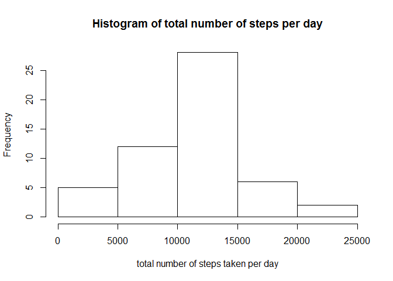
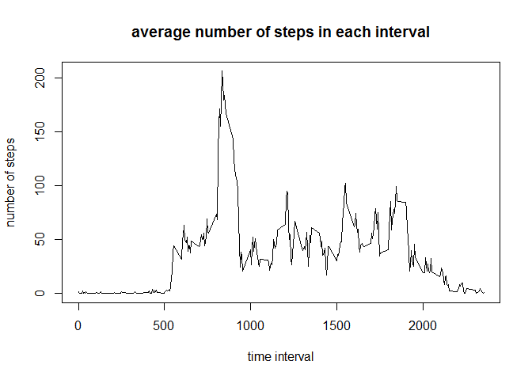
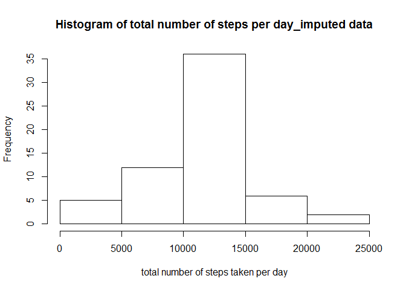
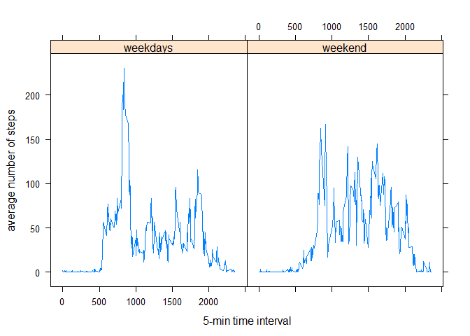

# Reproducible Research: Peer Assessment 1

# Introduction
It is now possible to collect a large amount of data about personal movement using activity monitoring devices such as a Fitbit, Nike Fuelband, or Jawbone Up. These type of devices are part of the "quantified self" movement - a group of enthusiasts who take measurements about themselves regularly to improve their health, to find patterns in their behavior, or because they are tech geeks. But these data remain under-utilized both because the raw data are hard to obtain and there is a lack of statistical methods and software for processing and interpreting the data.
This assignment makes use of data from a personal activity monitoring device. This device collects data at 5 minute intervals through out the day. The data consists of two months of data from an anonymous individual collected during the months of October and November, 2012 and include the number of steps taken in 5 minute intervals each day.


## Loading and preprocessing the data

```r
# set the working directory
setwd("C:/Users/User/Dropbox/Data Science/Jonhs Hopkins Courses/R coding practice _Ying/Repreducible research/RepData_PeerAssessment1")
# unzip and read the data 
unzip("activity.zip")
ActivityData <- read.csv("./activity.csv")
```
The data will be processes in each of the questions.

## What is mean total number of steps taken per day?
To answer this question, I first calculate the total number of steps taken per day and plot a histogram to have an overview. 

```r
# Calculate the total number of steps taken per day
SumSteps <- aggregate(steps ~ date, data=ActivityData, FUN=sum, na.rm = TRUE)
# Plot a histogram to over how many number of steps per day
hist(SumSteps$steps, xlab="total number of steps taken per day", main = "Histogram of total number of steps per day")
```

 

```r
# Calculate and report the mean and median of the total number of steps taken per day
round(mean(SumSteps$steps))
```

```
## [1] 10766
```

```r
round(median(SumSteps$steps))
```

```
## [1] 10765
```
The average number of steps per day is 10766, and the median is 10765.

## What is the average daily activity pattern?
To answer this question, I first calculate the mean number of steps in each 5-minutes time interval across the examing days. I then plot a time series graph. Finally I find out which day has the highest number of steps. It is the 835th interval.

```r
# Calculate the mean number of steps in each time interval across examing days
AverageSteps <- aggregate(steps ~ interval, data=ActivityData, FUN=mean, na.rm = TRUE)
# Make a time series plot (i.e. type = "l") of the 5-minute interval (x-axis) and the average number of steps taken, 
# averaged across all days (y-axis)
with(AverageSteps,  plot(interval, steps, xlab="time interval", ylab="number of steps", 
                         main="average number of steps in each interval", type ="l" )) 
```

 

```r
# Find out which 5-minute interval, on average across all the days in the dataset, contains the maximum number of steps?
index <- which.max(AverageSteps$steps)
AverageSteps$interval[index]
```

```
## [1] 835
```

## Imputing missing values

Have noted that there are some missing values in the recorded steps. I first find that there are 2304 missing values in total. I use mean of that 5 minutes inverval across examing days to impute the missing data. A new dataset without missing data is created. I then plot a histogram of the number of steps per day using the imputed dataset. The graph looks very similar as the histogram with the missing data. The mean and median of the number of steps using the imputed data are both 10766, which is the same as the mean of the number of steps using the data with missing values. This is because the imputation method I chose. 

```r
# Calculate and report the total number of missing values in the dataset (i.e. the total number of rows with NAs)
sum(is.na(ActivityData$steps))
```

```
## [1] 2304
```

```r
# I choose the mean of that 5 minutes inverval to impute the data and Create a new dataset that is equal to the original dataset but with the missing data filled in
ActivityImpute <- ActivityData
nobs <- nrow(ActivityImpute)
for (i in 1: nobs) {
        if (is.na(ActivityImpute$steps[i])){
                index_1 <- which(AverageSteps$interval == ActivityImpute$interval[i])
                ActivityImpute$steps[i] = AverageSteps$steps[index_1]
        }
}
# Make a histogram of the total number of steps taken each day and Calculate and report the mean and median 
# total number of steps taken per day. Do these values differ from the estimates from the first part of the assignment? 
SumSteps_impute <- aggregate(steps~date, data=ActivityImpute, FUN = sum, na.rm = T)
hist(SumSteps_impute$steps, xlab="total number of steps taken per day", 
     main = "Histogram of total number of steps per day_imputed data")
```

 

```r
# mean and median of the total number of steps every day
round(mean(SumSteps_impute$steps))
```

```
## [1] 10766
```

```r
round(median(SumSteps_impute$steps))
```

```
## [1] 10766
```
## Are there differences in activity patterns between weekdays and weekends?
I first create a new factor variable "weekday" in the dataset "Activity" to indicate that if the data is collected in the weekdays or weekend. I then make a panel plots of two time series of average number of steps in each 5-min time interval distinguished in weekdays and weekend. I find that during the weekdays, the peak activity happens in the early of the day, which is higher than during the weekend. However, on average, most of the walk is spreaded in the day during the weekends. It looks like people walk more during the whole day in the weekend than in the weekdays. 

```r
# Create a new factor variable in the dataset with two levels - "weekday" and "weekend" indicating 
# whether a given date is a weekday or weekend day. 
Activity <- cbind(ActivityImpute, day=weekdays(as.Date(ActivityImpute$date)))
daytype<-function(x){
        if ( x == "Saturday"){
                weekday= "weekend"
        }
        else if( x == "Sunday"){
                weekday= "weekend"
        }     
        else{ 
                weekday = "weekdays"
        }
        weekday
}
for(i in 1:nobs){
        Activity$weekday[i] = daytype(Activity$day[i])
}

# Make a panel plot containing a time series plot (i.e. type = "l") of the 5-minute interval (x-axis) 
# and the average number of steps taken, averaged across all weekday days or weekend days (y-axis). 
# See the README file in the GitHub repository to see an example of what this plot should look like using simulated data.
Activity_week <- aggregate(steps~interval+weekday, data=Activity, FUN = mean)

library(lattice)
xyplot(steps~interval|weekday, data = Activity_week, type = "l",
       xlab = "5-min time interval", ylab="average number of steps")
```

 
